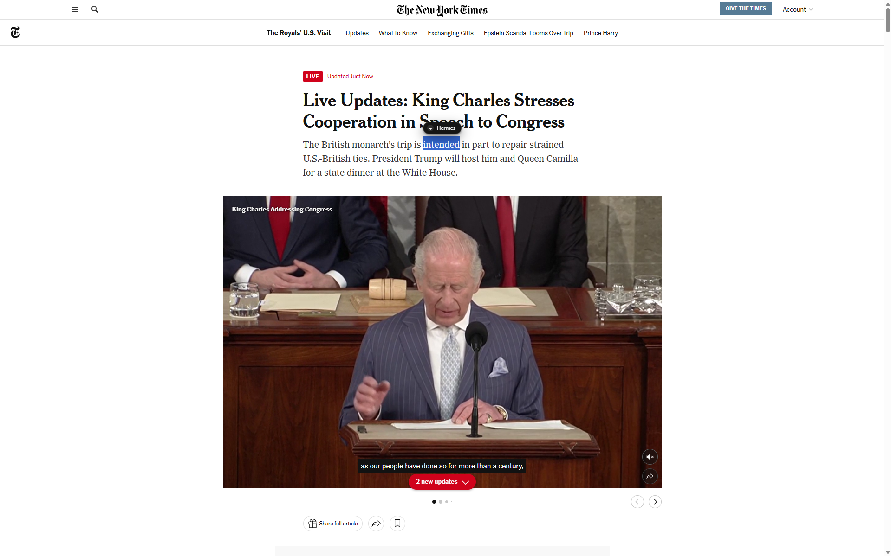
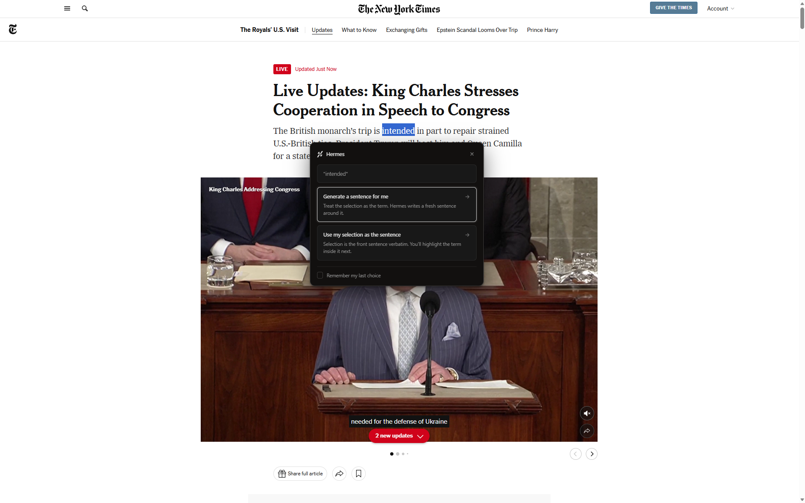
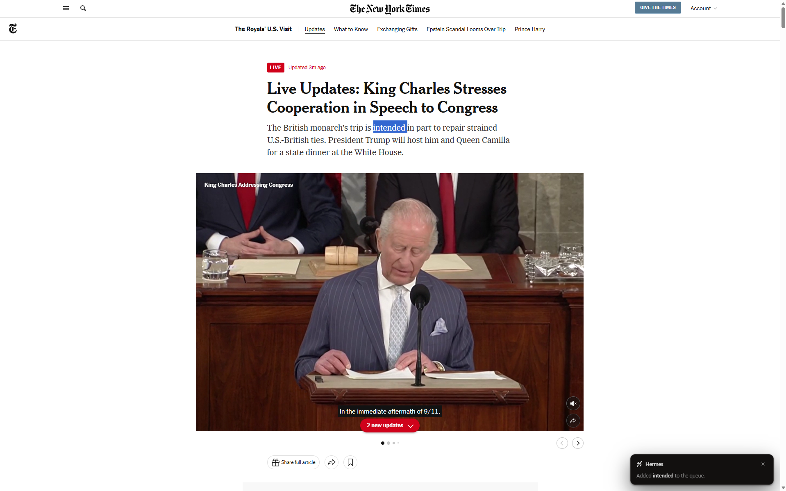
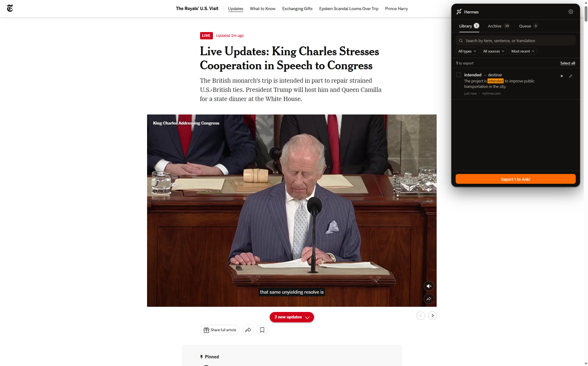
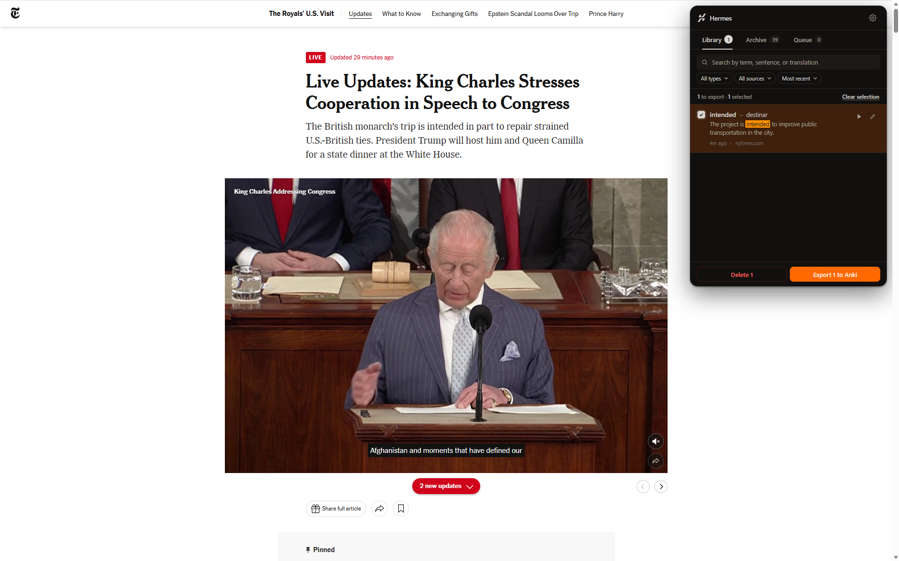
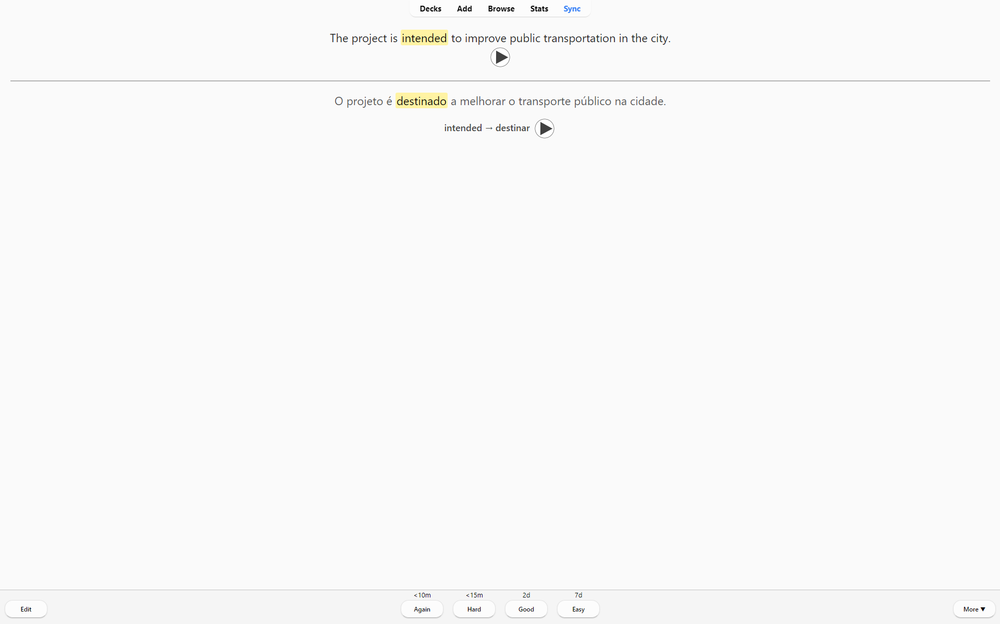

# Hermes 🃏

> Highlight a word, get an Anki flashcard. Any language pair. Your keys, your data.

Hermes is a Chromium extension that builds vocabulary flashcards while you read. Highlight a word or a sentence on **any** page; Hermes writes a natural example sentence around it (or keeps the one you selected), translates it into your fluent language, generates a pronunciation clip, and packages everything as a real `.apkg` you can drop into Anki. The capture pipeline talks **directly** to your LLM/TTS provider — there's no Hermes server in the middle.

## See it in 6 steps

| 1. Highlight any word on the page | 2. Choose how Hermes should phrase the card |
| --- | --- |
| Select a term — a floating "+" button appears next to it. (You can also right‑click or press `Ctrl/⌘+Shift+H`.) | Either **"Generate a sentence for me"** (Hermes writes a fresh natural sentence using the term) or **"Use my selection as the sentence"** (Hermes keeps your sentence verbatim, you mark the term inside it). |
|  |  |

| 3. The card is queued — keep reading | 4. Open the panel any time to review |
| --- | --- |
| A small toast confirms it. The agent runs in the background: writes the sentence, translates, synthesizes audio, saves the card. You don't have to wait. | Click the toolbar icon. A floating panel slides in over the page with three tabs: **Library** (ready to export), **Archive** (already exported), **Queue** (in flight). |
|  |  |

| 5. Export to Anki | 6. Review the card in Anki |
| --- | --- |
| Click *Export N to Anki* in the panel footer. Hermes builds a real `.apkg` (deterministic GUIDs so re‑imports update instead of duplicate) and downloads it as `export-YYYYMMDD-HHmm.apkg`. | Drop the `.apkg` into Anki — your sentence sits on the front (with the term highlighted + sentence audio), the translation + term‑pair audio sit on the back, ready for spaced repetition. |
|  |  |

## What's in the box

- **Floating in‑page panel.** No Chrome popup window — the panel renders inside the active tab, like Cuponomia. Click outside or press `Esc` to dismiss.
- **Two capture modes.**
  - *Generate* (Mode A): you give Hermes a term, it writes a 12–22 word sentence that uses the term unambiguously.
  - *Verbatim* (Mode B): you give Hermes a sentence + the slice that's the term, it keeps the sentence exactly and just translates.
- **Multi‑language out of the box.** Configure your **Learning** + **Fluent** language pair in Settings → Languages. Supported: English, Portuguese (Brazil), Spanish, French, German, Italian, Dutch, Japanese, Korean, Chinese (Simplified), Chinese (Traditional), Russian, Polish, Turkish, Arabic.
- **Bring your own LLM key.** Gemini · OpenAI · Anthropic · OpenRouter. Stored locally only — never synced.
- **Two voices.** Microsoft Edge "Read Aloud" (free, neural, English‑only) or ElevenLabs (paid, multi‑language).
- **Real `.apkg` export.** Cards build a SQLite‑backed Anki package (`sql.js` + `jszip`) with a custom *Hermes Card* note type. Re‑import updates existing notes by deterministic GUID — no duplicates.
- **Audio cache.** TTS clips are content‑addressed by `(text, voice, provider)` so re‑exports never re‑spend.
- **Privacy first.** Manifest V3, optional host permissions per provider, no analytics, no telemetry. Your selections leave your machine **only** for the calls you've authorised to your own provider.

## How it's wired

The capture-to-Anki pipeline runs as a sequence across the page, the service worker, and an offscreen document, with all heavy lifting (LangChain agent, sql.js, JSZip) confined to the offscreen so the SW stays light:

```mermaid
sequenceDiagram
    participant User as User<br/>(highlights text)
    participant CS as Content script<br/>(page)
    participant SW as Service worker
    participant OFF as Offscreen<br/>document
    participant LLM as LLM provider
    participant TTS as TTS provider
    participant DB as Dexie<br/>(IndexedDB)
    participant Panel as Floating panel
    participant Anki

    User->>CS: select text
    CS-->>User: floating "+" button + popover
    User->>CS: pick mode (Generate / Verbatim)
    CS->>SW: capture payload
    SW->>OFF: run-agent

    OFF->>LLM: enrich (sentence + translation, JSON schema)
    LLM-->>OFF: draft

    alt schema or echo-guard fails
        OFF->>LLM: retry with violation hint
        LLM-->>OFF: draft
        Note over OFF,LLM: up to 3 attempts
    end

    OFF->>TTS: synthesize sentence audio
    TTS-->>OFF: mp3
    opt term audio enabled
        OFF->>TTS: synthesize term audio
        TTS-->>OFF: mp3
    end

    OFF->>DB: save card + audio cache
    OFF->>SW: agent-event (result)
    SW-->>CS: collapse popover to toast

    User->>Panel: click toolbar icon
    Panel->>SW: list-cards / list-pending-runs
    SW->>DB: query
    DB-->>SW: rows
    SW-->>Panel: cards + queue

    User->>Panel: Export N to Anki
    Panel->>SW: export-anki
    SW->>OFF: build .apkg (sql.js + JSZip)
    OFF->>DB: read cards + audio bytes
    DB-->>OFF: blobs
    OFF->>OFF: <a download> click
    OFF-->>User: .apkg saved
    User->>Anki: import .apkg
    Anki-->>User: ready for SRS
```

The agent is a LangChain runner that asks the model for a single JSON object matching a Zod schema (sentence, translation, term, lemma, type), and re-asks with a violation hint if anything fails the verbatim‑substring or echo guards. The `.apkg` build runs in the offscreen because sql.js needs `document` for its wasm bootstrap; the download fires from a hidden `<a download>` click in that same offscreen — Chrome bug 579563 makes `chrome.downloads.download(filename)` unreliable on blob URLs.

## Repository layout

```
src/
├─ agent/             # LangChain runner, prompt template, schema
├─ anki/              # .apkg builder + note-type templates
├─ background/        # MV3 service worker (message broker, action toggle)
├─ components/        # Shared shadcn-style Select + Checkbox
├─ content/           # Floating button, capture popover, panel host
├─ edit/              # Card-editor SPA (one card → tweak fields, regenerate)
├─ lib/
│  ├─ providers/      # LLM/TTS host-permissions + connection tests
│  ├─ quota/          # Per-month usage roll-up
│  ├─ storage/        # Dexie schema + settings store
│  ├─ tts/            # Edge + ElevenLabs adapters, audio cache, mp3 encoder
│  └─ text/           # Sentence extraction
├─ offscreen/         # Hosts the agent runner + .apkg build
├─ onboarding/        # First-run wizard
├─ options/           # Settings SPA
├─ popup/             # The in-page floating panel (loaded inside an iframe)
└─ types/             # Shared TS types
public/icons/         # Toolbar / install icons (rendered by scripts/build-icons.mjs)
docs/
└─ screenshots/       # README walkthrough imagery
scripts/
└─ build-icons.mjs    # Pure-Node PNG generator for the H-monogram tile
```

## Getting started

```bash
npm install
npm run dev          # Vite + crxjs in watch mode
```

Then in Chrome / Edge:

1. Open `chrome://extensions` and enable **Developer mode**.
2. Click **Load unpacked** and pick the project's `dist/` directory.
3. The first time you select a provider in Settings, Chrome will prompt for the host permission Hermes needs to talk to it.

Production build:

```bash
npm run build        # outputs dist/
npm run typecheck    # tsc strict, no emit
```

To regenerate the toolbar icon set (if you change the brand glyph):

```bash
node scripts/build-icons.mjs
```

## Settings cheat sheet

Open the extension's options page (`chrome://extensions` → Hermes → *Details* → *Extension options*).

| Section | What you set |
| --- | --- |
| **Languages** | The pair Hermes works in. Drives the prompt and which voice providers are offered. |
| **Language model** | Provider + API key + model id. Test connection roundtrips a tiny request. |
| **Voice** | Edge (free, English‑only) or ElevenLabs (paid, multi‑language) + voice id. *Term audio* toggles a second clip on the back of the card. |
| **Anki export** | Default deck name (use `::` for nested decks) and tags applied to every card. |
| **Capture** | Toggle the floating button, the right‑click menu, and the `Ctrl/⌘+Shift+H` shortcut. |
| **Usage** | Per‑month roll‑up: LLM calls, TTS calls, tokens (in/out), estimated USD spend. |
| **Backup** | JSON (full‑fidelity, for re‑import) or CSV (read‑only inspection) export. |
| **Developer** | Stream the agent's tool steps live in the popover; optional LangSmith tracing. |

## Tech stack

| Layer | Tech |
| --- | --- |
| Build | Vite + `@crxjs/vite-plugin`, `vite-plugin-node-polyfills` |
| UI    | React 19, plain CSS with `lab(...)` color tokens (no design‑system framework) |
| State / storage | Dexie (IndexedDB) for cards + audio; `chrome.storage.local` for settings |
| Agent runtime | LangChain (`@langchain/core`, `@langchain/openai`, `@langchain/anthropic`, `@langchain/google-genai`, `langchain`), Zod schemas |
| TTS | Microsoft Edge "Read Aloud" (WebSocket) and ElevenLabs REST |
| Audio encoding | `@breezystack/lamejs` (MP3) |
| Anki export | `sql.js` (collection.anki2) + `jszip`, triggered via offscreen `<a download>` |

## Privacy & security

- **No backend.** The only network calls Hermes makes are to the LLM provider you configured, the TTS provider you configured, and the page you're capturing from.
- **Keys never leave your browser.** Stored in `chrome.storage.local` (not `sync`).
- **Optional host permissions.** Hermes only asks for a provider's host once you enable it in Settings.
- **Cards stay local.** Saved cards live in IndexedDB until you explicitly export to `.apkg` or hit *Backup → Export*.

## Acknowledgements

The capture flow + popover UX is inspired by Cuponomia's in‑page panel pattern. The card‑editor structure draws from Anki's note‑type model. The agent loop's design borrows ideas from the deepagents pattern.

## License

[MIT](LICENSE) © 2026 Elias Biondo
